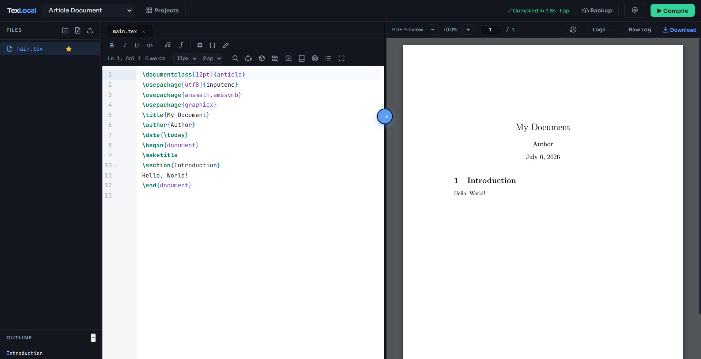
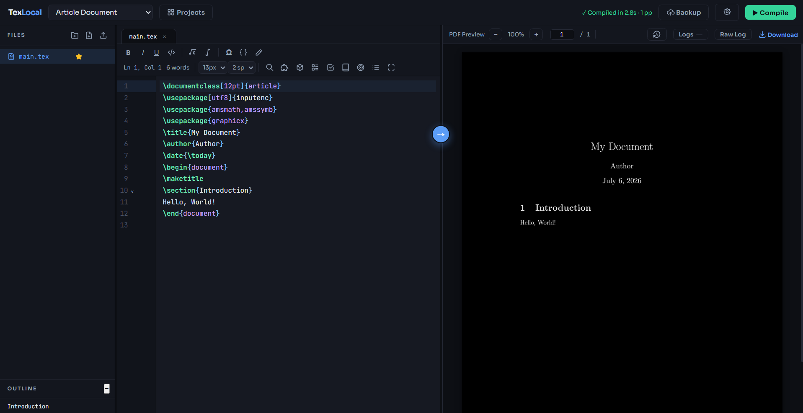
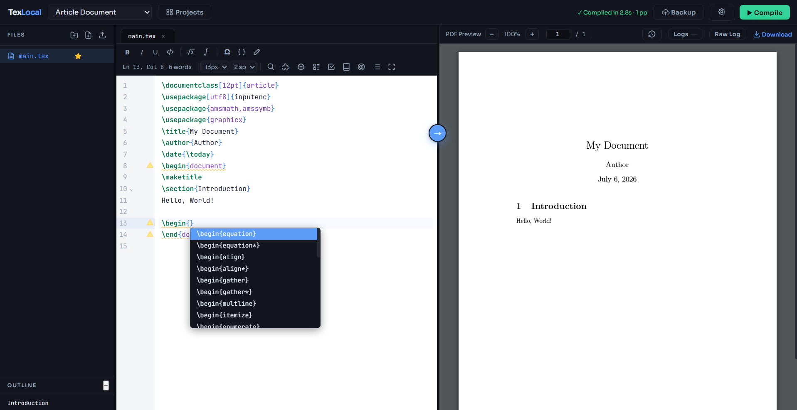
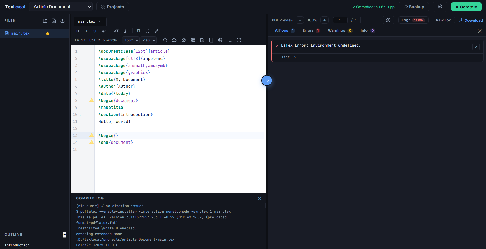
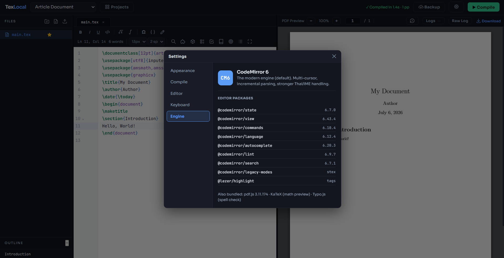

# TexLocal

A lightweight, self-hosted LaTeX editor that runs entirely on your own machine — no internet dependency, no compile timeout, full multi-file project support. Use it as a browser app or install the standalone Windows desktop build with bundled MiKTeX.


<p align="center">
  
  <br><sub><em>Write LaTeX on the left, see the compiled PDF on the right — all on your own machine.</em></sub>
</p>

---

## Screenshots

<table>
  <tr>
    <td width="50%" align="center">
      <br>
      <sub>Dark editor + PDF theme</sub>
    </td>
    <td width="50%" align="center">
      <br>
      <sub><code>\cite{}</code> autocomplete, read from your <code>.bib</code></sub>
    </td>
  </tr>
  <tr>
    <td width="50%" align="center">
      <br>
      <sub>Parsed errors / warnings with jump-to-line</sub>
    </td>
    <td width="50%" align="center">
      <br>
      <sub>Settings &#9656; Engine — editor engine &amp; versions</sub>
    </td>
  </tr>
</table>

---

## Features

### Editing
- **CodeMirror 6 editor** — LaTeX syntax highlighting, section folding (`Ctrl+Shift+[ / ]`), auto-close brackets, multi-tab editing, and smooth handling of large documents and mixed Thai/English text
- **Multi-cursor** — `Alt`-click to add cursors, `Alt`-drag for column / rectangular selection
- **Autocomplete** — `\cite{}` (reads your `.bib` keys), `\ref{}` (reads your labels), `\begin{}` environments, and LaTeX commands
- **Snippet library** — tab-expandable snippets with placeholder navigation; per-project custom snippets
- **Spell check** — English (Typo.js/Hunspell) with red wavy underlines, right-click suggestions, and per-project custom dictionary
- **Find & Replace** — in-file, plus project-wide replace-all
- **Quick Open** — fuzzy file switcher (`Ctrl+P`)
- **Symbol & environment palettes** — insert math symbols and LaTeX environments from a panel
- **Closable, resumable tabs** — × / middle-click to close; reopens your last file and cursor line when you reopen a project
- **User-macro autocomplete** — your own `\newcommand` / `\newenvironment` definitions are suggested as you type
- **Auto-save** — every 800 ms; manual save with `Ctrl+S`
- **Safe multi-tab editing** — one tab owns project writes at a time; other
  same-project tabs are read-only until an explicit warned takeover, and stale
  buffers are rejected instead of overwriting newer disk content

> The editor runs exclusively on CodeMirror 6. The retired CodeMirror 5 fallback and vendored assets were removed during the source v6.0.0 line.

### Compiling
- **pdflatex / xelatex / lualatex** — no timeout; per-project compiler preference is remembered
- **Draft mode** — skip figures for fast recompiles on figure-heavy documents
- **`\includeonly` support** — compile a subset of chapters without editing the source
- **Auto-compile toggle** — recompile on every save; `Ctrl+Enter` to compile manually
- **BibTeX / Biber** — auto-detected and run as needed
- **Parsed log panel** — Errors / Warnings / Info with jump-to-line, error grouping, and missing-package detection; raw log viewer for debugging
- **Compile history** — recent compiles with their logs

### PDF & Navigation
- **In-browser PDF preview** (pdf.js) — zoom, page jump, outline panel, dark-mode tint; one-click download
- **SyncTeX** — forward search (`Ctrl+Alt+→`) and backward search (Ctrl-click in the PDF jumps to the source line)

### Project Tools
- **File manager** — create, rename, delete files/folders; drag-and-drop upload
- **Local History** — automatic text-file checkpoints, A/M/D comparison,
  Milestones, exact-byte Restore with a reversible pre-restore checkpoint,
  Save as copy, retention controls, and corruption-safe storage cleanup
- **Image viewer** — preview image files inline
- **Import / Export ZIP** — import an Overleaf-exported ZIP; export a clean project ZIP
- **Writing goals & word count** — per-project goals tracking with live word count
- **TODO scanner** — collects `\todo{}` and `% TODO / FIXME / XXX` markers
- **Bibliography audit** — find unresolved, duplicate, and unused `\cite` keys; jump to them; reversibly comment out unused entries
- **Light / dark themes**, plus a switchable **Cerulean appearance** (Settings → Appearance) — independent of light/dark mode

### GitHub & Packages
- **Sign in with GitHub** in-app (device-flow, no CLI) and **back up a project** in one click — git init + LaTeX-aware `.gitignore` + commit + create repo + push (private by default)
- **Import from GitHub** and **pull remote changes** (auto-stashes your local edits)
- **Safe remote recovery** — clearly distinguishes healthy, local-only,
  unlinked, inaccessible, empty, moved, diverged, and unrelated-history states;
  recovery is explicit and preserves local commits, project bytes, and Local
  History when validation fails
- **Package manager panel** — see the packages your document uses, check what's installed, and open MiKTeX / TeX Live to add any that are missing

> GitHub sign-in and Grammar mode work best in browser/source mode; Grammar mode is browser-only (it relies on browser grammar extensions).

---

## Two Ways to Run

### A) Windows Desktop App (recommended)

Download **`TexLocal-Setup-7.1.0.exe`** from the
[Releases page](https://github.com/FourthPs/Tex-Local-Public/releases) and run
it. The current-user installer requires no administrator account and includes
the portable MiKTeX environment used for local compilation.

The v7.1.0 installer provides two Start Menu entries backed by the same projects
and protected backend:

- **TexLocal** opens the native WebView2 desktop window.
- **TexLocal Web** opens the editor in the default browser and provides a tray
  icon for Open/Exit.

Only one Desktop or Web owner runs at a time. Clear in-app notices explain which
mode is active and how to switch. Browser tabs have a separate per-project
writer rule, so different projects can be edited simultaneously without letting
two same-project tabs silently overwrite each other.

> **Windows security notice:** the v7.1.0 installer is not currently
> Authenticode-signed, so Windows SmartScreen may display a warning. Download it
> only from the official Releases page and verify the SHA-256 checksum published
> with the release.

#### Upgrading from an older all-users installation

Older TexLocal builds may be registered for all Windows users, while v7.1.0 is
a current-user installation. Back up your projects, uninstall the older
all-users entry, and then install v7.1.0. Installing directly over the old entry
can leave conflicting uninstall registrations. Project folders are preserved by
the current installer design, but an external backup is still recommended.

#### v7.1.0 installer checksum

`TexLocal-Setup-7.1.0.exe`

SHA-256:

`8bff8c333dba62304c2d574b0c45a5eda65a8f1dd6f993e8029cf0404f36d799`

### B) From Source

**1. Clone**
```bash
git clone https://github.com/FourthPs/Tex-Local-Public.git
cd Tex-Local-Public
```

**2. Install Python dependencies**
```bash
pip install -r requirements.txt
```

**3. Run**
```bash
python texlocal.py
```

> **Source availability note:** this public repository currently retains the
> **v5.8.7 Python source snapshot**. The v7.1.0 Go application is distributed as
> the Windows installer above; do not expect the source-mode commands in this
> section to reproduce the v7.1.0 desktop runtime.

**4. Open** `http://texlocal.localhost:52839` (opens automatically; `http://127.0.0.1:52839` also works)

Source mode uses whatever LaTeX distribution is on your system PATH.

---

## Requirements (source mode only)

- Python 3.10–3.12
- A LaTeX distribution:
  - **Windows** — [MiKTeX](https://miktex.org/download)
  - **macOS** — [MacTeX](https://www.tug.org/mactex/) or `brew install --cask mactex`
  - **Linux** — `sudo apt install texlive-full`

The desktop installer (option A) bundles MiKTeX — no separate install needed.

---
## Project Structure

```
texlocal/
├── texlocal/               ← Backend package: core.py (app + state + helpers),
│   │                          routes/ (Flask Blueprints), __main__.py (web entry)
├── texlocal_app.py         ← Desktop bootstrap (PyWebView window)
├── templates/
│   ├── index.html          ← Editor UI shell
│   └── dashboard.html      ← Project list + auto-update banner
├── static/
│   ├── editor.css          ← Editor styling
│   ├── editor.js + modules ← Editor logic (files / panels / autocomplete / spell / …)
│   └── vendor/cm6/         ← CodeMirror 6 offline bundle + adapter
├── projects/               ← Your LaTeX projects (git-ignored)
└── requirements.txt
```

---
## Thai Language Support

To compile documents with Thai text, use **XeLaTeX** and install Thai fonts such as TH Sarabun New or [Kinnari](https://linux.thai.net/projects/thaifonts-scalable). TexLocal is used in production for a Thai+English physics thesis compiled with `polyglossia`.

---

## Tech Stack

| Layer | v7.1.0 release | Public source snapshot |
|-------|----------------|------------------------|
| Backend | Go `net/http` | Python + Flask |
| Desktop | Go + WebView2 + Inno Setup | PyWebView |
| Frontend | Vanilla HTML / CSS / JavaScript | Vanilla HTML / CSS / JavaScript |
| Editor | CodeMirror 6 (stex mode) | CodeMirror 6 (stex mode) |
| PDF | pdf.js | pdf.js |
| LaTeX | pdflatex / xelatex / lualatex (bundled MiKTeX) | System LaTeX distribution |

---

## Third-Party Licenses

TexLocal bundles or links the following open-source libraries:

| Library | License |
|---------|---------|
| Go webview2 | MIT |
| Flask | BSD-3-Clause |
| CodeMirror 6 | MIT |
| pdf.js | Apache-2.0 |
| Typo.js | BSD / LGPL |
| PyWebView | BSD-3-Clause |
| MiKTeX (desktop installer) | Mixed (LPPL, MIT, GPL per package) |

---

## License

MIT
